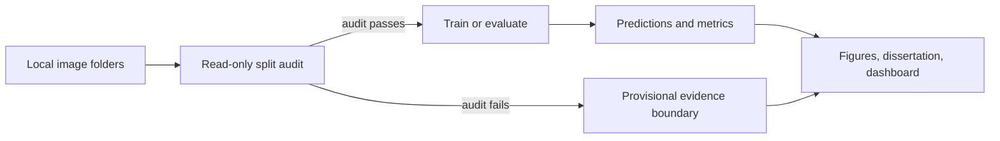
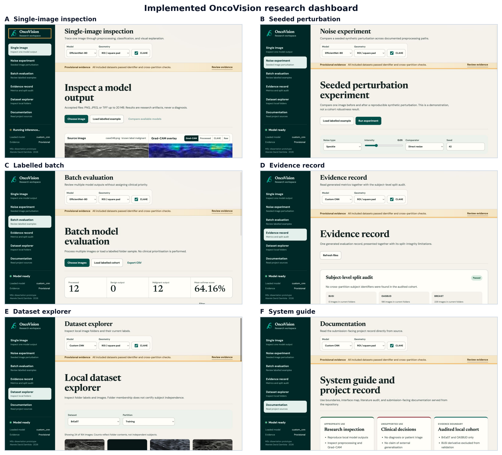

# Breast Cancer Ultrasound Classification Using Machine Learning

> **MSc research prototype, not a clinical device.** This repository documents a reproducible binary breast-ultrasound classification study and must not be used for diagnosis or patient-management decisions.

<p align="center">
  <a href="#evidence-status">Evidence status</a> ·
  <a href="#quick-start">Quick start</a> ·
  <a href="#project-map">Project map</a> ·
  <a href="#submission-artifacts">Artifacts</a> ·
  <a href="#before-submission">Before submission</a>
</p>

## Evidence status

| Current checkpoint | Evaluation record | Interpretation |
| --- | --- | --- |
| EfficientNet-B0 | **62 images** · **67.74% accuracy** · **0.6774 macro F1** · **0.7419 ROC-AUC** · **0.6803 AP** | **Audited local-cohort evidence; not clinical validation** |

This checkpoint was trained on the repaired BrEaST and OASBUD subject-level splits. The local BUSI copy remains outside the validated cohort because it was renamed and converted into square derivatives. Those changes prevent patient grouping and prevent the published duplicate, label-conflict, overlay, and non-breast-image checks from being repeated against the original release. Adding its files would increase the sample count without making the test evidence more trustworthy. These values demonstrate a reproducible local-cohort experiment; they are not a clinical-performance estimate.

### Extended evaluation from stored predictions

No model was retrained for this analysis. The existing `outputs/predictions.csv` supports the following additional checks:

| Diagnostic | Result | Interpretation |
| --- | ---: | --- |
| Malignant precision | 0.6364 | 21 of 33 malignant outputs were correct. |
| Malignant recall | 0.7241 | 21 of 29 malignant cases were identified at the fixed 0.5 threshold. |
| Average precision | 0.6803 | Threshold-swept malignant precision and recall, with prevalence 0.4677. |
| Brier score | 0.2144 | Mean squared error of the malignant probability. Lower is better. |
| Expected calibration error | 0.0652 | Five-bin probability calibration summary from the evaluator. |

Source-level results differ: BrEaST accuracy is 0.7813 on 32 images, while OASBUD accuracy is 0.5667 on 30 images. This is an exploratory source check, not proof that either dataset is intrinsically easier or better. The plotted record is rebuilt by `scripts/generate_report_figures.py` and stored in `outputs/extended_evaluation.json`.

### Internal model benchmark

| Model | Accuracy | Macro F1 | ROC-AUC |
| --- | ---: | ---: | ---: |
| EfficientNet-B0 | **67.74%** | **0.6774** | **0.7419** |
| Custom CNN | 64.52% | 0.6452 | 0.6708 |
| ResNet-50 | 56.45% | 0.5374 | 0.6364 |

This is a same-split architecture comparison on 62 held-out images, not a comparison with published clinical benchmarks. The bootstrap 95% intervals for EfficientNet-B0 are wide (accuracy 56.45-79.03%; ROC-AUC 0.6217-0.8616), so the ranking is exploratory.

The canonical explanation, affected identifiers, and next steps are in [Results status](docs/RESULTS_STATUS.md). The [Moi Hoon Yap literature audit](docs/MOI_HOON_YAP_LITERATURE_AUDIT.md) records ten relevant works and their verification status. Superseded visual assets are retained under [`docs/archive/`](docs/archive/) with an explicit warning rather than being presented as current evidence.



## Quick start

```bash
python3 -m venv venv
venv/bin/pip install -r requirements.txt

# Rebuild auditable subject-level splits when source folders have been curated.
venv/bin/python scripts/rebuild_subject_splits.py breast --output data/breast.subject_clean
venv/bin/python scripts/rebuild_subject_splits.py oasbud --output data/oasbud.subject_clean
# Review each split_manifest.json, then replace the active folders with the clean copies.

# Inspect data integrity before interpreting a result.
venv/bin/python scripts/audit_data.py --datasets breast oasbud --output outputs/data_audit.json

# Recreate the current evaluation record and start the local dashboard.
venv/bin/python evaluate.py --split test
venv/bin/python scripts/benchmark_models.py --split test
venv/bin/python api.py
```

Open [http://localhost:8000](http://localhost:8000) to explore an individual model output, generated evidence, a seeded noise demonstration, batch processing, dataset folders, and project documentation.



The documentation screen starts with the intended-use boundary. The dashboard supports research inspection, reproducibility checks, and presentation of stored evidence. It must not be used for diagnosis, patient triage, clinical management, or claims of performance outside the audited local cohort.

## Project map

| Area | Purpose |
| --- | --- |
| [`src/`](src/) | Shared PyTorch data, model, training, evaluation, prediction, and FastAPI code. |
| [`scripts/audit_data.py`](scripts/audit_data.py) | Read-only split and identifier audit. |
| [`scripts/data_split.py`](scripts/data_split.py) | Deterministic, copy-only subject-level splitter with a JSON manifest. |
| [`scripts/generate_report_figures.py`](scripts/generate_report_figures.py) | Rebuilds evidence figures, including dataset and prediction examples. |
| [`tests/`](tests/) | Regression checks for preprocessing and evidence boundaries. |
| [`web/`](web/) | Local research workspace served by FastAPI. |
| [`latex/`](latex/) | Canonical dissertation source and compiled PDF. |
| [`latex_university/`](latex_university/) | MMU-standard Overleaf-compatible dissertation source and expanded report. |
| [`docs/`](docs/) | Submission-facing documentation, chapters, and supporting analysis. |

Raw `data/`, model checkpoints, and transient build products remain local because
they can be large, licensed, or derived from local runs. A small, reviewable
evidence record is tracked in [`outputs/README.md`](outputs/README.md), including
the reported metrics, benchmark summaries, predictions, and publication figures.

## Submission artifacts

| Artifact | Location |
| --- | --- |
| Compiled MMU-standard dissertation with EthOS evidence | [`submission/Akerele_David_25908322_Dissertation.pdf`](submission/Akerele_David_25908322_Dissertation.pdf) |
| Complete Overleaf source (self-contained) | [`submission/Akerele_David_25908322_Overleaf_Source.zip`](submission/Akerele_David_25908322_Overleaf_Source.zip) |
| Submission package manifest and upload guide | [`submission/README_FIRST.md`](submission/README_FIRST.md) |
| Updated Terms of Reference | [`submission/Akerele_David_25908322_Terms_of_Reference.docx`](submission/Akerele_David_25908322_Terms_of_Reference.docx) |
| Editable presentation with speaker notes | [`Akerele_David_25908322_Presentation.pptx`](docs/presentation/Akerele_David_25908322_Presentation.pptx) |
| Product repository for assessment | [github.com/DavidAkerele/breast-cancer-ultrasound-classification-ml](https://github.com/DavidAkerele/breast-cancer-ultrasound-classification-ml) |
| Executed analysis notebook | [`Breast_Cancer_Ultrasound_Classification_Dissertation.ipynb`](Breast_Cancer_Ultrasound_Classification_Dissertation.ipynb) |
| Dataset-quality figure | [`latex_university/figures/fig9_dataset_quality_examples.png`](latex_university/figures/fig9_dataset_quality_examples.png) |
| Correct and incorrect prediction plate | [`latex_university/figures/fig10_prediction_examples.png`](latex_university/figures/fig10_prediction_examples.png) |
| Implemented dashboard figure | [`latex_university/figures/fig11_web_interface.png`](latex_university/figures/fig11_web_interface.png) |
| Precision-recall and calibration figure | [`latex_university/figures/fig12_discrimination_calibration.png`](latex_university/figures/fig12_discrimination_calibration.png) |
| Source-stratified evaluation figure | [`latex_university/figures/fig13_source_stratified_performance.png`](latex_university/figures/fig13_source_stratified_performance.png) |
| Personal summary and presentation guide | [`docs/PERSONAL_PROJECT_SUMMARY_AND_PRESENTATION_GUIDE.md`](docs/PERSONAL_PROJECT_SUMMARY_AND_PRESENTATION_GUIDE.md) |
| Final overhaul and verification record | [`docs/FINAL_OVERHAUL_REPORT.md`](docs/FINAL_OVERHAUL_REPORT.md) |

Rebuild authored artifacts after changing source material:

```bash
venv/bin/python scripts/build_notebook.py
venv/bin/python scripts/execute_notebook.py
(cd latex_university && tectonic --keep-logs report.tex)
# docs/presentation/build_pptx.mjs uses the bundled Codex presentation runtime.
```

The complete Moodle bundle and the larger project-source archive are generated
locally from the manifest in `submission/README_FIRST.md`. They are not committed
to GitHub because the full bundle exceeds GitHub's 100 MB single-file limit; the
repository retains the complete editable source and the final report-facing
artifacts needed to reproduce it.

## Reproducible workflow

Training, evaluation, command-line prediction, and API inference share CLAHE, geometry selection, normalisation, and paired-mask discovery (`_mask.png`, `_tumor.png`, or `_lesion_mask.png`). Evaluation writes `outputs/metrics.json`, `outputs/predictions.csv`, a confusion matrix, and a ROC curve; reported tables should always be generated from those files.

```bash
venv/bin/python src/compute_project_tables.py
venv/bin/python scripts/generate_report_figures.py
venv/bin/python -m unittest discover -s tests -v
```

Validated training uses BrEaST and OASBUD by default through `TRAIN_DATASETS=breast,oasbud`. The local BUSI derivative remains excluded because its provenance cannot support the required audit. Training blocks a failed audit by default. Use the following override only for an explicitly provisional engineering run:

```bash
venv/bin/python train.py --model efficientnet_b0 --epochs 25 --seed 42 --allow-unaudited-data
```

## Before submission

1. Confirm the report states that BUSI is excluded from the validated cohort and makes no claim based on its derivative files.
2. Verify every final numerical claim against `outputs/metrics.json`, `outputs/predictions.csv`, and `outputs/extended_evaluation.json`.
3. Confirm that the PDF contains the confusion matrix, ROC curve, precision-recall and calibration plot, source analysis, and correct and incorrect prediction examples.
4. Run the tests and inspect the compiled PDF for missing references, overflow, broken figures, and repeated pages.
5. Verify that the embedded EthOS email, reference number 92016, signed declaration, and project scope/title match the approval record.
6. Use the university naming convention `Akerele_David_25908322_Dissertation.pdf` and `Akerele_David_25908322_Presentation.pdf` for the Moodle uploads.

The completed checkpoints retain only the selected epoch, validation loss, and validation accuracy. They do not contain enough information to reconstruct full learning curves. The training program now records every epoch for future runs, but the report does not fabricate a historical curve.
