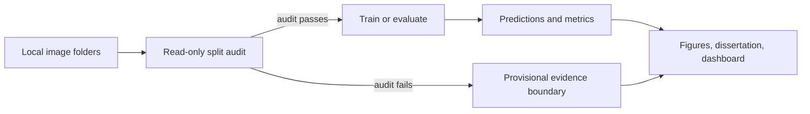

# Breast Ultrasound Classification Dissertation

> **MSc research prototype — not a clinical device.** This repository documents a reproducible binary breast-ultrasound classification study and must not be used for diagnosis or patient-management decisions.

<p align="center">
  <a href="#evidence-status">Evidence status</a> ·
  <a href="#quick-start">Quick start</a> ·
  <a href="#project-map">Project map</a> ·
  <a href="#submission-artifacts">Artifacts</a> ·
  <a href="#before-submission">Before submission</a>
</p>

## Evidence status

| Current checkpoint | Evaluation record | Interpretation |
| --- | --- | --- |
| EfficientNet-B0 | **120 images** · **78.33% accuracy** · **0.7811 macro F1** · **0.8612 ROC-AUC** | **Provisional engineering evidence only** |

The local split audit finds cross-partition subjects in OASBUD and BrEaST and cannot verify subject separation in the renamed BUSI copy. These values demonstrate that the end-to-end software path works; they are not a patient-independent or clinical-performance estimate.

The canonical explanation, affected identifiers, and next steps are in [Results status](docs/RESULTS_STATUS.md). Superseded visual assets are retained under [`docs/archive/`](docs/archive/) with an explicit warning rather than being presented as current evidence.



## Quick start

```bash
python3 -m venv venv
venv/bin/pip install -r requirements.txt

# Inspect data integrity before interpreting a result.
venv/bin/python scripts/audit_data.py --output outputs/data_audit.json

# Recreate the current evaluation record and start the local dashboard.
venv/bin/python evaluate.py --split test
venv/bin/python api.py
```

Open [http://localhost:8000](http://localhost:8000) to explore an individual model output, generated evidence, a seeded noise demonstration, batch processing, dataset folders, and project documentation.

## Project map

| Area | Purpose |
| --- | --- |
| [`src/`](src/) | Shared PyTorch data, model, training, evaluation, prediction, and FastAPI code. |
| [`scripts/audit_data.py`](scripts/audit_data.py) | Read-only split and identifier audit. |
| [`scripts/data_split.py`](scripts/data_split.py) | Deterministic, copy-only subject-level splitter with a JSON manifest. |
| [`tests/`](tests/) | Regression checks for preprocessing and evidence boundaries. |
| [`web/`](web/) | Local research workspace served by FastAPI. |
| [`latex/`](latex/) | Canonical dissertation source and compiled PDF. |
| [`docs/`](docs/) | Submission-facing documentation, chapters, and supporting analysis. |

`data/` and `outputs/` are local-only because they can be large, licensed, or derived from local checkpoints.

## Submission artifacts

| Artifact | Location |
| --- | --- |
| Canonical dissertation | [`latex/main.pdf`](latex/main.pdf) |
| Editable Word companion | [`Breast_Cancer_Ultrasound_Dissertation.docx`](docs/presentation/Breast_Cancer_Ultrasound_Dissertation.docx) |
| Editable viva deck with speaker notes | [`Breast_Cancer_Ultrasound_Dissertation_Presentation.pptx`](docs/presentation/Breast_Cancer_Ultrasound_Dissertation_Presentation.pptx) |
| Executed analysis notebook | [`Breast_Cancer_Ultrasound_Classification_Dissertation.ipynb`](Breast_Cancer_Ultrasound_Classification_Dissertation.ipynb) |

Rebuild authored artifacts after changing source material:

```bash
venv/bin/python scripts/build_notebook.py
venv/bin/python scripts/execute_notebook.py
venv/bin/python docs/presentation/build_docx.py
(cd latex && tectonic --keep-logs main.tex)
venv/bin/python docs/presentation/build_pptx.py  # Requires Codex Desktop's presentation runtime.
```

## Reproducible workflow

Training, evaluation, command-line prediction, and API inference share CLAHE, geometry selection, normalisation, and paired-mask discovery (`_mask.png`, `_tumor.png`, or `_lesion_mask.png`). Evaluation writes `outputs/metrics.json`, `outputs/predictions.csv`, a confusion matrix, and a ROC curve; reported tables should always be generated from those files.

```bash
venv/bin/python src/compute_project_tables.py
venv/bin/python -m unittest discover -s tests -v
```

Training blocks a failed audit by default. Use the following override only for an explicitly provisional engineering run:

```bash
venv/bin/python train.py --model efficientnet_b0 --epochs 25 --seed 42 --allow-unaudited-data
```

## Before submission

1. Rebuild the cohort at subject level, keeping every view and mask for a subject in one partition.
2. Preserve original BUSI identifiers in a manifest; the current `sample_*` names cannot prove patient separation.
3. Retrain on the audited cohort with fixed seeds and retain configuration, checkpoint, and prediction records.
4. Regenerate the result chapter, figures, notebook, Word file, slides, and dashboard from that audited evidence.
5. Verify every final claim against `outputs/metrics.json` and `outputs/predictions.csv`.
