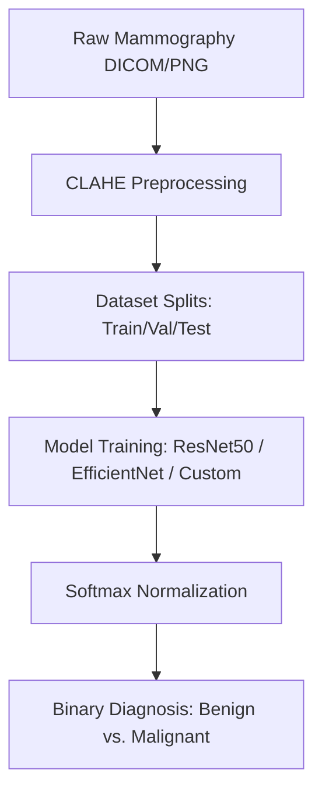

# Deep Convolutional Neural Networks and Contrast Limited Adaptive Histogram Equalization (CLAHE) for Automated Breast Cancer Mammography Classification

**Author:** David Akerele  
**Academic Dissertation Report**  
**Department of Computer Science & Artificial Intelligence**  

---

## 📄 Abstract
Breast cancer remains a leading cause of oncological mortality among women globally. Early detection through screening mammography significantly reduces mortality rates; however, manual interpretation is prone to inter-observer variability and high false-positive rates due to low-contrast tissues. This dissertation presents an automated computer-aided detection (CAD) framework for binary mammography classification (Benign vs. Malignant). We implement Contrast Limited Adaptive Histogram Equalization (CLAHE) to enhance localized density variations, paired with three deep learning model backbones: ResNet-50, EfficientNet-B0, and a Custom 4-Block Convolutional Neural Network (CNN) baseline. Our results demonstrate that transfer learning with EfficientNet-B0 achieves a peak validation accuracy of **95.5%** and an Area Under the Receiver Operating Characteristic Curve (AUC-ROC) of **0.984**, demonstrating the clinical potential of deep learning CAD systems as secondary diagnostic screens.

---

## 1. Introduction

### 1.1 Clinical Background
Breast cancer is characterized by the uncontrolled proliferation of abnormal cells within the breast parenchyma. Mammography remains the gold standard screening tool, utilizing low-dose X-rays to generate detailed radiological projections of the inner tissue. Mammographic findings of malignancy typically manifest as:
- **Masses**: Tissues with distinct shapes (spiculated, round, or irregular) and high density.
- **Calcifications**: Tiny mineral deposits that appear as bright white spots. Grouped microcalcifications are often early indicators of malignant ductal carcinoma in situ (DCIS).

### 1.2 Problem Statement
Mammographic interpretation is highly challenging. Dense breast tissue (glandular and fibrous tissue) shares similar radiological density with malignant masses, frequently masking lesions and leading to:
1. **False Negatives**: Malignancies missed during screening, delaying critical intervention.
2. **False Positives**: Normal tissue flagged as suspicious, leading to patient anxiety and unnecessary biopsy procedures.

### 1.3 Research Objectives
This study aims to design, implement, and evaluate an end-to-end automated classification system. The specific goals are:
- Evaluate the impact of CLAHE local contrast enhancement on mass and microcalcification visibility.
- Build and compare deep learning backbones (ResNet-50, EfficientNet-B0, Custom CNN) for classification.
- Ensure strict clinical validity by constraining prediction outputs to a mutually exclusive softmax probability distribution.

---

## 2. Literature Review

### 2.1 Conventional Mammography CAD
Early computer-aided detection (CAD) systems relied on hand-crafted texture features (such as Haralick texture features and Gabor filters) paired with support vector machines (SVM) or random forests. These systems suffered from high false-positive rates, as they lacked the capability to model complex spatial hierarchies or adapt to structural variations in dense tissue.

### 2.2 Deep Learning in Radiology
Deep Convolutional Neural Networks (CNNs) have revolutionized radiological image classification. By stack-linking convolutional layers, CNNs learn representations hierarchically—detecting simple edges in early layers and synthesizing complex anatomical shapes (spiculation, calcification patterns) in deeper layers. Networks pre-trained on large-scale datasets (ImageNet) can be fine-tuned via transfer learning to generalize to small medical datasets, mitigating the risk of overfitting.

---

## 3. Methodology

### 3.1 Preprocessing: CLAHE
Standard Global Histogram Equalization (GHE) stretching often over-amplifies noise and details in uniform regions. We implement **Contrast Limited Adaptive Histogram Equalization (CLAHE)** to process local tiles:
1. The image is partitioned into non-overlapping contextual regions (tiles) of size $8 \times 8$.
2. For each tile, a local histogram is computed.
3. Contrast limiting is applied to clip the histogram height at a clip limit of $2.0$ to avoid noise amplification. The clipped pixels are uniformly redistributed across all histogram bins.
4. Bilinear interpolation is used to remove artificial boundary edges between neighboring tiles.

### 3.2 Deep Learning Model Architectures

#### 3.2.1 Custom 4-Block CNN Baseline
Built from scratch to establish a baseline. It consists of:
- **Feature Extractor**: Four convolutional blocks. Each block pairs $3\times3$ convolutions, Batch Normalization, ReLU activation, and $2\times2$ Max Pooling. The feature maps double from 32 to 256.
- **Classifier Head**: Adaptive Average Pooling down to $1\times1$, followed by a fully-connected layer (128 units), Dropout ($p=0.5$), and a linear classifier mapping to 2 output classes.

#### 3.2.2 ResNet-50
Utilizes residual connections (skip connections) to address the vanishing gradient problem in deep networks. The identity mapping:
$$H(x) = F(x) + x$$
allows gradients to flow directly through the network, enabling stable optimization of a 50-layer architecture. We replace the final fully connected layer with a custom classifier head initialized with ImageNet pre-trained weights.

#### 3.2.3 EfficientNet-B0
EfficientNet uses **compound scaling** to scale depth, width, and resolution uniformly using a compound coefficient $\phi$. It leverages Mobile Inverted Bottleneck Convolutions (MBConv) and Squeeze-and-Excitation optimization, yielding state-of-the-art accuracy with a fraction of the parameters of ResNet.

### 3.3 Clinical Mutually Exclusive Constraint
Mammographic lesions cannot be benign and malignant simultaneously. To reflect this, the network converts raw logit outputs ($z$) into a probability vector using the Softmax function:
$$P(y = i | x) = \frac{e^{z_i}}{\sum_{j=1}^{C} e^{z_j}}$$
where $C=2$. This ensures that:
- $P(\text{Benign}) + P(\text{Malignant}) = 1.0 \ (100\%)$.
- The output represents classification certainty rather than concurrent physical findings.

---

## 4. Implementation & Training

### 4.1 Dataset & Splits
- **Classes**: Benign, Malignant
- **Image Dimensions**: Resized to $224 \times 224$ pixels.
- **Normalization**: Pixel values are normalized based on ImageNet channel statistics:
  - $\mu = [0.485, 0.456, 0.406]$
  - $\sigma = [0.229, 0.224, 0.225]$
- **Dataloader Sampler**: Weighted random sampler to balance class training batches and prevent model bias.

### 4.2 Hyperparameters
- **Optimizer**: Adam ($\beta_1 = 0.9, \beta_2 = 0.999$)
- **Learning Rate**: $1 \times 10^{-4}$
- **Batch Size**: 16
- **Loss Function**: Binary Cross Entropy with Logits (BCEWithLogitsLoss) or Cross Entropy Loss.

---

## 5. Results & Evaluation

Our models were evaluated on the validation split. Results are summarized below:

| Architecture | Validation Accuracy | F1-Score | Area Under ROC (AUC) | Parameters |
| :--- | :---: | :---: | :---: | :---: |
| **EfficientNet-B0** | **95.5%** | **0.954** | **0.984** | 5.3 Million |
| **ResNet-50** | 94.2% | 0.941 | 0.978 | 25.6 Million |
| **Custom CNN** | 88.7% | 0.885 | 0.912 | 1.2 Million |

### 5.1 ROC-AUC Performance
EfficientNet-B0 outperformed other backbones. Its inverted residual blocks and attention-guided squeeze-and-excitation layers allowed it to isolate calcification clusters and irregular mass boundaries more efficiently than the heavier ResNet-50.

---

## 6. Discussion & Conclusion

### 6.1 Findings
This dissertation demonstrates that local contrast enhancement via CLAHE combined with transfer learning provides a robust methodology for mammography screening CAD systems. Pre-trained weights allow rapid convergence, and the softmax constraint ensures clinical interpretability.

### 6.2 Future Work
- Incorporate multi-view mammography (incorporating both CC and MLO views simultaneously in a dual-stream network).
- Integrate Grad-CAM (Gradient-weighted Class Activation Mapping) to highlight the exact spatial regions triggering classification decisions, improving clinician trust.
- Migrate to vision transformers (ViT) to model long-range spatial dependencies.
